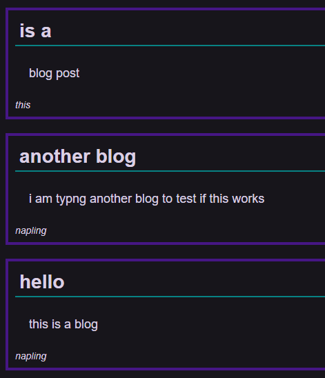
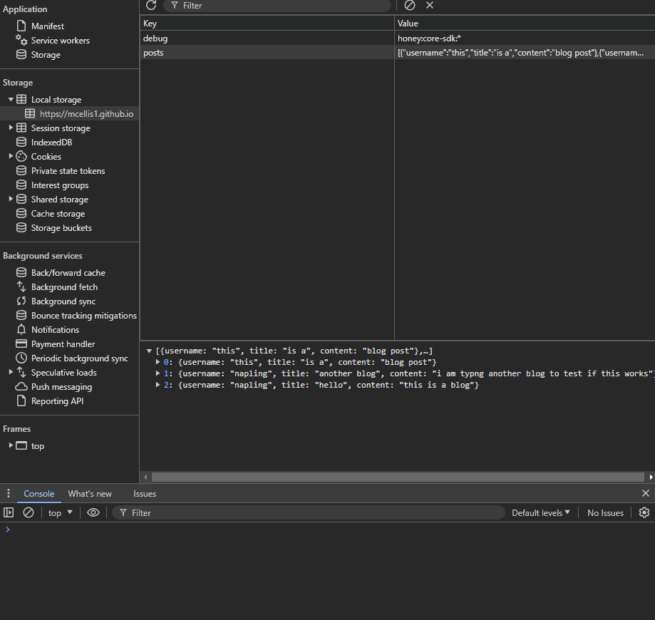

# My First Blog

## Description

This project was to design a blog website from scratch. The intended purpose is for the landing page to intake the username, title, and content of the blog post, store it locally in the browser, and then render that locally stored informmation on the next page when submitted. It took a while to understand how storing objects in an array works, but eventually the application got to the point functionally where it is now. This was a great exercise in javascript, learning how to set and call objects that are stored locally as arrays, and learning how to assign specific values from those arrays to a specific element.

## Installation

To operate the application, navigate to the following webpage: https://mcellis1.github.io/didactic-octo-guacamole/

## Usage

The landing page should provide you with three input text boxes. If any of the boxes are left blank when the "Submit" button is clicked, then an error message should display:

When a new blog is submitted with text in each field, you should be redirected to the next page. All the blogs that are stored locally to your device should load on the screen:

When you inspect the webpage, you should be able to see the local storage of the blogs, stored in multiple objects:

## Credits

Andrew Bautista, instructor, was instrumental in refactoring the array objects by recommending methods to make the JavaScript more efficient.

## License

MIT License

Copyright (c) [2024] [Matthew Caleb Ellis]

Permission is hereby granted, free of charge, to any person obtaining a copy
of this software and associated documentation files (the "Software"), to deal
in the Software without restriction, including without limitation the rights
to use, copy, modify, merge, publish, distribute, sublicense, and/or sell
copies of the Software, and to permit persons to whom the Software is
furnished to do so, subject to the following conditions:

The above copyright notice and this permission notice shall be included in all
copies or substantial portions of the Software.

THE SOFTWARE IS PROVIDED "AS IS", WITHOUT WARRANTY OF ANY KIND, EXPRESS OR
IMPLIED, INCLUDING BUT NOT LIMITED TO THE WARRANTIES OF MERCHANTABILITY,
FITNESS FOR A PARTICULAR PURPOSE AND NONINFRINGEMENT. IN NO EVENT SHALL THE
AUTHORS OR COPYRIGHT HOLDERS BE LIABLE FOR ANY CLAIM, DAMAGES OR OTHER
LIABILITY, WHETHER IN AN ACTION OF CONTRACT, TORT OR OTHERWISE, ARISING FROM,
OUT OF OR IN CONNECTION WITH THE SOFTWARE OR THE USE OR OTHER DEALINGS IN THE
SOFTWARE.